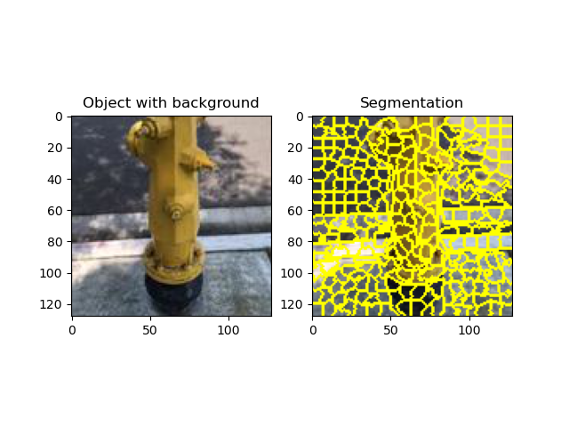

# ExactSuperpixels


## Key Features

- **Exact Superpixel Count**: Unlike standard SLIC implementations, ExactSuperpixels guarantees **the exact number of superpixels requested**.
- **Adaptive Segmentation**: Automatically adjusts the initial oversegmentation and merges regions to achieve the desired superpixel count.
- **Robust Merging Strategy**: Employs a sophisticated method to merge smaller segments while maintaining image structure.
- **Flexible Parameter Control**: Allows fine-tuning of compactness and smoothing parameters for optimal results.
  
## Example

### n_desired=256 





## Installation

To use ExactSuperpixels, you'll need Python 3.6+ and the following dependencies:

```bash
pip install numpy scikit-image matplotlib
```

## Usage

Here's a simple example of how to use the `exact_num_superpixels` function:


```python
import numpy as np
from skimage import io
from exactsuperpixels import exact_num_superpixels

# Load an image
image = io.imread('path_to_your_image.jpg')

# Generate superpixels
n_desired = 100  # Desired number of superpixels
segments = exact_num_superpixels(image, n_desired, compactness=10, sigma=0)

# Now 'segments' contains the superpixel labels
```

or You can download demo to customize. 

## How It Works

1. **Initial Oversegmentation**: The function starts by creating more superpixels than desired using the SLIC algorithm.

2. **Adjustment Process**:
   - If there are too few superpixels, it increases the number and tries again.
   - If there are too many, it begins a merging process.

3. **Merging Process**:
   - Identifies the smallest superpixel.
   - Finds its neighboring superpixels.
   - Merges the smallest superpixel with its smallest neighbor.
   - Repeats until the desired number of superpixels is reached.

4. **Validation**: Ensures the final number of superpixels matches the desired count.

## Contributing

Contributions to this project are welcome! Please feel free to submit a Pull Request.

## License

This project is licensed under the MIT License - see the [LICENSE](LICENSE) file for details.

## Acknowledgments

- This implementation is based on the SLIC algorithm from scikit-image.
- Special thanks to the scikit-image and NumPy communities for their excellent libraries.
