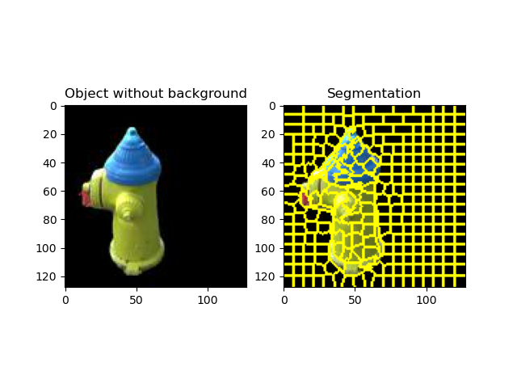

# ExactSuperpixels（精确超像素分割）
[English](README.md)
## 主要特点

- **精确超像素数量**：与标准 SLIC 实现不同，ExactSuperpixels 保证**生成的超像素数量与请求的完全一致**。
- **自适应分割**：自动调整初始过分割并合并区域，以达到所需的超像素数量。
- **稳健的合并策略**：采用复杂的方法合并较小的分割区域，同时保持图像结构。
- **灵活的参数控制**：允许微调紧密度和平滑参数以获得最佳结果。

## 示例

### n_desired=256 




## 安装

要使用 ExactSuperpixels，您需要 Python 3.8+ 以及以下依赖：

```bash
pip install numpy scikit-image matplotlib
```


## 使用方法

以下是使用 `exact_num_superpixels` 函数的简单示例：

python

```python
import numpy as np
from skimage import io
from exactsuperpixels import exact_num_superpixels

# 加载图像
image = io.imread('path_to_your_image.jpg')

# 生成超像素
n_desired = 100  # 期望的超像素数量
segments = exact_num_superpixels(image, n_desired, compactness=10, sigma=0)

# 现在 'segments' 包含了超像素标签
```


或者您可以下载演示代码进行自定义。

## 工作原理

1. **初始过分割**：函数首先使用 SLIC 算法创建比所需更多的超像素。
2. **调整过程**：
   - 如果超像素数量太少，增加数量并重试。
   - 如果超像素数量太多，开始合并过程。
3. **合并过程**：
   - 识别最小的超像素。
   - 找到其邻近的超像素。
   - 将最小的超像素与其最小的邻居合并。
   - 重复直到达到所需的超像素数量。
4. **验证**：确保最终的超像素数量与所需数量匹配。

## 贡献

欢迎对本项目做出贡献！请随时提交 Pull Request。

## 许可证

本项目采用 MIT 许可证 - 详情请见 [LICENSE](https://mytan.maiseed.com.cn/LICENSE) 文件。

## 致谢

- 本实现基于 scikit-image 的 SLIC 算法。
- 特别感谢 scikit-image 和 NumPy 社区提供的优秀库